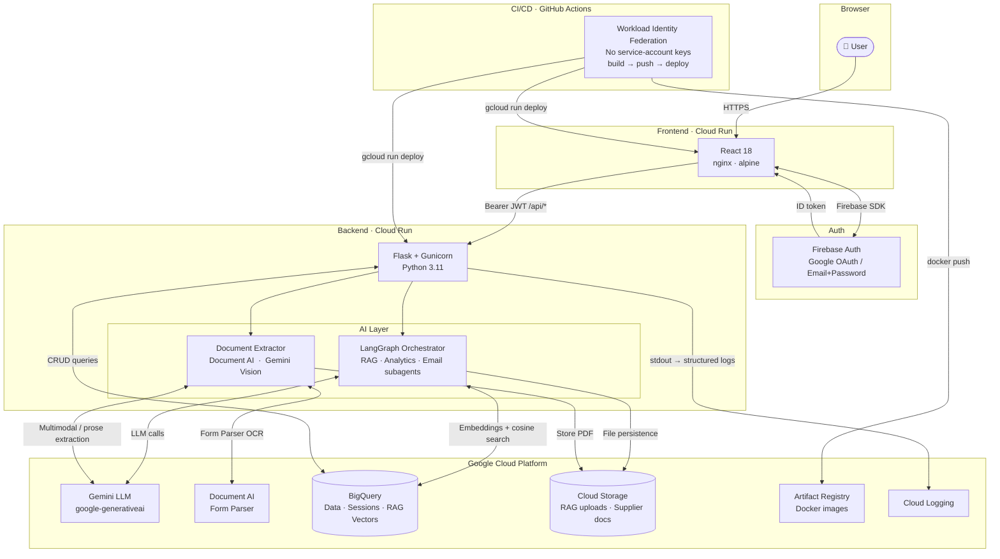

# App Manager — Intelligent Business Management Platform

A full-stack web application for managing clients, insurances and suppliers, augmented with an AI assistant, a RAG knowledge base, and an RPA document extractor. Deployed on Google Cloud Platform with a fully automated CI/CD pipeline.

---

## Architecture



---

## What the application does

| Module | Description |
|---|---|
| **Clients** | Full CRUD for client records with role-based access |
| **Insurances** | Manage insurance policies linked to clients |
| **Suppliers** | Manual CRUD + AI-assisted onboarding via document upload |
| **AI Chatbot** | Conversational assistant that queries live data, searches the knowledge base, and sends emails on behalf of the user |
| **Knowledge Base (RAG)** | Upload PDF/TXT/MD documents; the assistant can answer questions grounded on them |
| **Supplier RPA** | Upload any supplier PDF — the app extracts structured fields (name, company, email, age) automatically using Document AI or Gemini |

---

## Technology stack

### Programming languages
| Language | Where |
|---|---|
| **Python 3.11** | Flask REST API, LangChain/LangGraph agents, BigQuery queries, GCS integration |
| **JavaScript (React 18)** | Single-page application, all UI components, Firebase Auth SDK |

### Cloud services — Google Cloud Platform
| Service | Purpose |
|---|---|
| **Cloud Run** | Serverless containers for both frontend (nginx) and backend (gunicorn). Scales to zero, pays per request |
| **BigQuery** | Primary data store — CRUD tables (clients, insurances, suppliers, users), chat sessions + messages, RAG vector embeddings as `ARRAY<FLOAT64>` with cosine similarity in Python |
| **Cloud Storage (GCS)** | Persists uploaded files: RAG documents (`rag_uploads/`), deleted documents (`rag_uploads_deleted/`), supplier PDFs (`supplier_docs/`) |
| **Document AI** | Form Parser processor — extracts key-value pairs from structured PDF forms with confidence scores |
| **Artifact Registry** | Private Docker image registry used by the CI/CD pipeline |
| **Cloud Logging** | Aggregates all stdout/stderr from both Cloud Run services. Queryable via Log Explorer or `gcloud logging read` |
| **Workload Identity Federation** | Allows GitHub Actions to authenticate to GCP without storing any service-account key file |

### Artificial Intelligence
| Component | Technology |
|---|---|
| **LLM** | Google Gemini via `langchain-google-genai` — powers the chatbot and document extraction |
| **Agent framework** | LangGraph `StateGraph` with a MemorySaver checkpointer — orchestrator routes to RAG, analytics, and email subagents |
| **RAG** | FAISS (local dev) or custom BigQuery vector store (cloud) — PDF/TXT/MD chunked with `RecursiveCharacterTextSplitter`, embedded with Gemini embeddings, retrieved by cosine similarity |
| **Conversation memory** | LangGraph MemorySaver hydrated from BigQuery on cold start — context survives server restarts |

### RPA — Robotic Process Automation
Automates supplier data entry from any document format:

| Engine | Best for |
|---|---|
| **Google Document AI Form Parser** | Structured forms with labelled fields — returns key-value pairs with confidence scores |
| **Gemini LLM (text mode)** | Unstructured documents — letters, CVs, contracts; extracts fields from natural prose |
| **Gemini LLM (vision / multimodal)** | Scanned image-only PDFs — sends raw PDF bytes as `inline_data`; Gemini performs built-in OCR |

The user picks the engine from the UI; both return the same `{name, surname, age, email, company}` shape and pre-fill an editable form before saving.

### CI/CD
| Tool | Role |
|---|---|
| **GitHub Actions** | Two independent workflows (one per repo), triggered on push to `main` |
| **Workload Identity Federation** | Keyless GCP authentication — GitHub's OIDC token is exchanged for short-lived GCP credentials |
| **Docker + Buildx** | Multi-stage builds with GitHub Actions cache (`type=gha`) |
| **Artifact Registry** | Stores versioned Docker images tagged with `github.sha` |
| **`google-github-actions/deploy-cloudrun`** | Deploys a new Cloud Run revision and passes env vars from GitHub secrets |

**Pipeline flow:**
```
push to main
    ├── Authenticate (WIF — no key file stored anywhere)
    ├── docker build & push → Artifact Registry
    └── gcloud run deploy   → Cloud Run (new revision, zero downtime)

pull request → docker build only (validates Dockerfile, no GCP access)
```

### Other libraries & frameworks
| Library | Purpose |
|---|---|
| `flask-jwt-extended` | JWT access tokens issued after Firebase ID-token verification |
| `firebase-admin` | Verifies Firebase ID tokens on the backend |
| `flask-cors` | CORS policy restricted to the frontend Cloud Run URL |
| `flasgger` | Auto-generates Swagger UI at `/apidocs` |
| `pypdf` | Text extraction from PDFs for the Gemini text path |
| `reportlab` + `Pillow` | Generate test PDFs (structured forms, prose letters, image-only scans) |
| `python-dotenv` | Layered `.env` loading (`.env` → `.env.<FLASK_ENV>` → `.env.local`) |

---

## Repository structure

```
react_langchain_front/          # This repo — React frontend
├── src/
│   ├── features/
│   │   ├── auth/               # Firebase login, Google OAuth
│   │   ├── chatbot/            # Floating AI chat widget + session management
│   │   ├── clients/            # CRUD views
│   │   ├── insurances/         # CRUD views
│   │   ├── suppliers/          # CRUD + RPA document upload
│   │   └── rag/                # Knowledge base upload / status / clear
│   ├── layouts/AppDashboard.js # Navigation shell
│   └── components/             # Shared UI components
├── Dockerfile                  # node:18 builder → nginx:alpine
├── nginx.conf                  # Cloud Run port 8080, SPA routing, COOP header
└── .github/workflows/
    └── deploy.yml              # GitHub Actions CI/CD

python_langchain_back/          # Backend repo — Flask API
├── app.py                      # Flask app factory, CORS, JWT config
├── routes/                     # Blueprints: auth, chat, suppliers, rag, ...
├── ai/
│   ├── chatbot_chain.py        # LangGraph memory + public chat() interface
│   ├── orchestrator.py         # Subagent routing (RAG · analytics · email)
│   └── document_extractor.py  # Document AI + Gemini extraction strategies
├── core/                       # BigQuery sessions, storage abstraction
├── rag/                        # Vector store (FAISS/BQ), bucket helpers
├── Dockerfile                  # python:3.11-slim + gunicorn
└── .github/workflows/
    └── deploy.yml              # GitHub Actions CI/CD
```

---

## Local development

```bash
# Frontend
npm install
echo "REACT_APP_API_URL=http://localhost:5000" > .env
npm start

# Backend (separate terminal)
cd ../python_langchain_back
python -m venv venv && venv\Scripts\activate
pip install -r requirements.txt
cp .env.example .env   # fill in GOOGLE_API_KEY etc.
python app.py
```

See [`CI_CD_SETUP.md`](../python_langchain_back/CI_CD_SETUP.md) in the backend repo for the one-time GCP infrastructure setup.
